# Real-time Alerts MVP

## MVP Scope (Phase 1)
- Watchlists
- Live signals (stored + streamed)
- Alert rules + alert events
- WebSocket streaming: signal updates + alert fired events

## Local Quickstart
1) Copy env:
   cp .env.example .env

2) Start backend stack:
   docker-compose up --build

3) Run migrations:
   docker-compose exec api alembic upgrade head

4) Frontend (run locally):
   cd frontend
   npm install
   npm start

## API
- Health: GET http://localhost:8000/health
- WebSocket: ws://localhost:8000/ws

## Architecture

## Endpoints currently defined:

GET /api/v1/health — basic health check (runs a simple DB query).
GET /api/v1/health/db — DB health check using a session.
WS /api/v1/ws — WebSocket: accepts, sends a hello, then echoes client messages.
POST /api/v1/watchlists — create a watchlist.
GET /api/v1/watchlists — list watchlists where deleted_at is null.
DELETE /api/v1/watchlists/{watchlist_id} — soft delete; sets is_deleted and deleted_at, and enqueues cleanup.
POST /api/v1/watchlists/{watchlist_id}/compute — enqueue signal computation for a watchlist.

## WebSocket Events (v1)
Server -> Client messages (JSON):
- {"type":"signal_update","payload":{...}}
- {"type":"alert_fired","payload":{...}}
